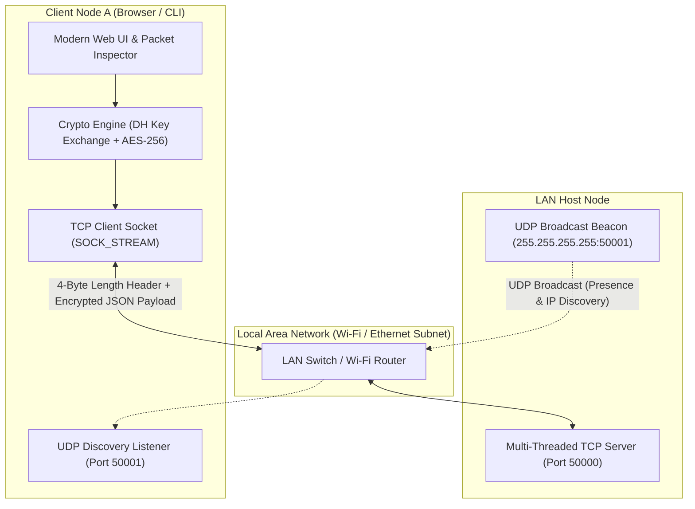
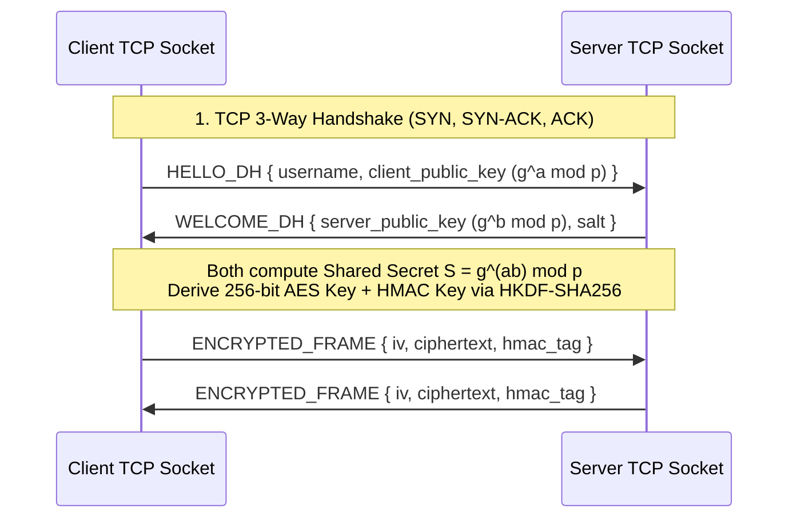

# LAN-Based Secure Chat Application — Computer Networks (CN) Project Guide

## 1. Project Overview (Abstract)
The **LAN-Based Secure Chat Application** is an offline-capable, real-time messaging and file-sharing system that operates entirely over a **Local Area Network (LAN / Wi-Fi)** without requiring internet access. 

In standard LAN environments, network traffic is vulnerable to **packet sniffing (e.g., via Wireshark)** and **Man-in-the-Middle (MitM)** attacks. This project solves that problem by combining:
1. **UDP Broadcast Peer Discovery** (`SOCK_DGRAM`) to automatically detect active hosts and chat servers on the subnet without manual IP configuration.
2. **Multi-Threaded TCP Socket Communication** (`SOCK_STREAM`) with **Length-Prefixed Packet Framing** for reliable, ordered delivery of group chats, private direct messages (DMs), and file transfers.
3. **End-to-End / Transport-Layer Cryptography (Diffie-Hellman Key Exchange + AES-256 Authenticated Encryption + SHA-256 HMAC)** so intercepted network packets reveal only unreadable ciphertext.

---

## 2. System Architecture & Protocol Stack

### Mapping to the TCP/IP & OSI Model (Important for Viva!)

| OSI Layer | TCP/IP Layer | How Our Project Implements It |
| :--- | :--- | :--- |
| **7. Application** | Application | Custom JSON Chat Protocol (`HANDSHAKE`, `MSG_GROUP`, `MSG_DM`, `FILE_CHUNK`, `PEER_LIST`) + Length-Prefixed Framing. |
| **6. Presentation** | Application | **Encryption & Encoding**: Diffie-Hellman (RFC 3526 MODP Group) Key Exchange, **AES-256-CTR + HMAC-SHA256** (or AES-GCM) encryption, Base64/UTF-8 serialization. |
| **5. Session** | Application | Session ID management, active socket authentication, heartbeats, and graceful disconnect handling. |
| **4. Transport** | Transport | **TCP (`SOCK_STREAM`, Port `50000`)** for reliable chat/file transfer + **UDP (`SOCK_DGRAM`, Port `50001`)** for connectionless LAN discovery. |
| **3. Network** | Internet | **IPv4 Addressing** (`AF_INET`), Subnet Broadcast (`255.255.255.255`), LAN interface detection (`192.168.x.x` / `10.x.x.x`). |
| **1–2. Data Link & Physical** | Network Access | Ethernet (IEEE 802.3) / Wi-Fi (IEEE 802.11) frames via OS NIC & ARP resolution. |

---

## 3. Core Computer Networks Mechanisms Implemented

### A. Why Both UDP and TCP? (Hybrid Architecture)
* **UDP (`socket.SOCK_DGRAM` + `SO_BROADCAST`) for Discovery**:
  When a device joins a Wi-Fi network, it doesn't know the IP address of the chat server or other peers. Using TCP would require scanning all 254 IPs on a `/24` subnet (slow and noisy). Instead, UDP broadcasts a lightweight beacon (`140 bytes`) to `255.255.255.255:50001` every few seconds.
* **TCP (`socket.SOCK_STREAM` + `TCP_NODELAY`) for Messaging**:
  Chat messages and files cannot tolerate packet loss or out-of-order arrival. TCP provides **3-way handshake (`SYN`, `SYN-ACK`, `ACK`)**, sequence numbers, acknowledgments, and flow control.

### B. Custom Application-Layer Framing (Solving TCP Stream Sticking)
Because TCP is a **byte-stream protocol** (not a message-boundary protocol), two fast `send()` calls can merge into one `recv()` call, or a large file can split across multiple `recv()` calls.
Our protocol prefixes every packet with a **4-byte Big-Endian Unsigned Integer (`!I`)** indicating the exact byte length of the payload:

$$\text{Frame} = \underbrace{\texttt{[4 Bytes: Payload Length } N\texttt{]}}_{\text{Network Byte Order (!I)}} + \underbrace{\texttt{[}N \text{ Bytes: JSON Envelope + Ciphertext]}}_{\text{UTF-8 / AES Encrypted Payload}}$$

### C. Cryptographic Handshake & Packet Security

---

## 4. Top Viva Questions & Answers

> [!TIP]
> **Q1: Why didn't you use only UDP or only TCP?**
> **Answer:** TCP is connection-oriented and unicast (1-to-1), so it cannot broadcast to an unknown network to discover peers. UDP supports broadcasting (`255.255.255.255`) without connection setup overhead, making it ideal for LAN discovery. Once the IP is discovered, we switch to TCP so chat messages and files are guaranteed to arrive reliably and in order.

> [!TIP]
> **Q2: How does your server handle multiple users chatting at the same time?**
> **Answer:** The TCP server uses **multithreading** (`threading.Thread`). A main listener socket binds to port `50000` and calls `accept()` in a loop. Each time a client connects, `accept()` returns a dedicated client socket descriptor, and the server spawns a daemon worker thread to handle that client's reading/writing independently while synchronizing shared state with a `threading.Lock()`.

> [!TIP]
> **Q3: What happens if someone captures packets on the LAN using Wireshark?**
> **Answer:** During connection setup, the client and server perform a **Diffie-Hellman (DH) Ephemeral Key Exchange**. The private keys never cross the network. Both sides independently derive the same **256-bit symmetric session key** using SHA-256. Every message payload is encrypted with a random 16-byte IV (Initialization Vector) and authenticated with **HMAC-SHA256**, preventing both eavesdropping and packet tampering.
